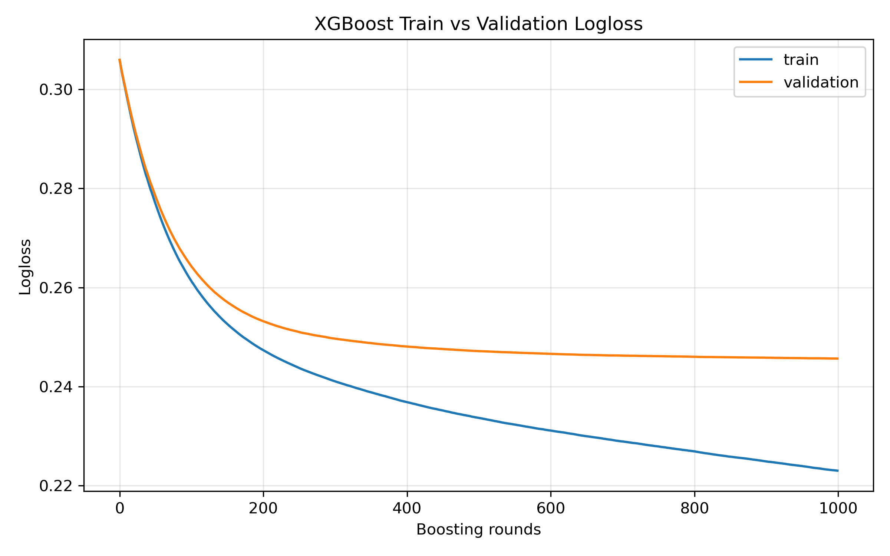
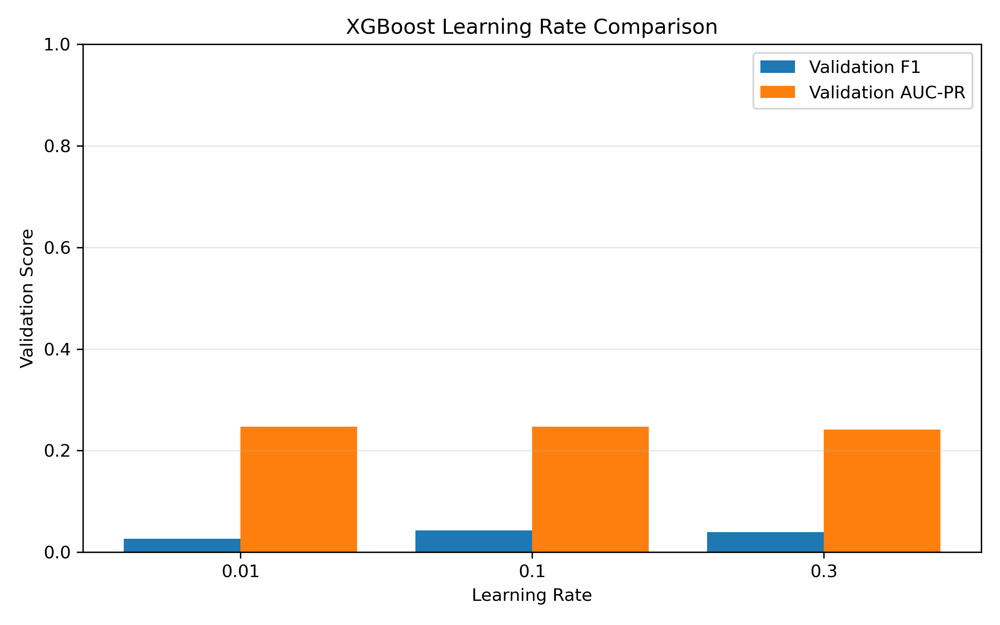

# Home Credit Default Risk 实验报告

## 1. 引言

这次作业的任务是做一个信用违约预测模型。更具体地说，我们希望根据贷款申请人的个人信息、收入情况、家庭情况、历史外部评分等特征，预测该客户之后是否会出现还款困难。这个问题本质上是一个二分类任务：

- `TARGET = 1`：客户有还款困难
- `TARGET = 0`：客户没有明显还款困难

这个任务很典型，也很适合机器学习建模。原因是信用风险问题通常同时具有下面几个特点：

1. 数据是典型的结构化表格数据
2. 数值特征和类别特征混合在一起
3. 缺失值很多
4. 类别分布不平衡，违约客户往往远少于正常客户

这类问题非常适合拿来比较树模型和神经网络模型在结构化数据上的表现差异。

本次实验只使用主表 `application_train.csv`，不额外拼接 `bureau`、`previous_application` 等辅表。

如果一开始就引入多表 join、复杂聚合特征和竞赛式特征工程，虽然可能会提升分数，但会让实验变得很重，也不利于把重点放在“模型对比”和“作业要求覆盖”上。

本报告的核心目标有三个：

1. 说明数据是如何被清洗、切分和编码的
2. 比较 `XGBoost` 和 `MLPClassifier` 在同一数据划分上的表现
3. 根据实验结果给出清楚、直接的结论，而不是只贴几个指标

## 2. 数据集与任务背景

### 2.1 数据来源

实验使用 Kaggle 的 Home Credit Default Risk 数据集，主表文件为：

- `data/application_train.csv`

其含义是客户是否出现还款困难。也就是说，这次模型不是预测贷款额度，也不是预测客户收入，而是预测“这个客户是不是未来更容易违约”。

### 2.2 数据规模

根据数据摘要文件，原始训练数据的规模如下：

- 样本总数：307,511
- 原始列数：122

在删除无意义的 ID 列并加入少量轻量特征工程之后，最终建模使用的特征数为：

- 总特征数：124
- 数值特征：108
- 类别特征：16
  
### 2.3 标签分布与不平衡问题

这份数据最大的挑战之一，是标签非常不平衡。正类比例大约是：

- 正类比例：8.07%
- 负类比例：91.93%

这件事非常重要，因为它会直接影响我们如何看模型效果。

如果一个模型几乎总是预测“不会违约”，那它的 Accuracy 也会很高，甚至可以接近 92%。但这种模型显然是没什么实际价值的，因为它没有把真正的违约客户识别出来。

所以这次实验里，虽然我仍然会报告 Accuracy，但不会把它作为最核心指标。更关注：

- `Recall`：模型抓到了多少真正的违约客户
- `Precision`：模型说“会违约”的那些人里，有多少真的违约
- `F1`：Precision 和 Recall 的折中
- `AUC-PR`：在不平衡问题里，比 Accuracy 更有代表性的排序指标

如果只看 Accuracy，很容易得出错误结论；如果结合 AUC-PR、Recall 和 F1，模型的优劣就会更清楚。

## 3. 数据预处理

### 3.1 数据划分方式

数据划分使用的是分层抽样，比例为：

- Train: 70%
- Validation: 15%
- Test: 15%

对应到样本数就是：

- Train: 215,257
- Validation: 46,127
- Test: 46,127

使用分层抽样，因为正负样本比例差异很大，如果随机切分不做分层，某个子集里的违约比例可能会明显偏离原始数据，导致评估不稳定。

实验里使用 Validation 集来做超参数选择，Test 集只在最后评估一次。这个顺序是：

1. 用 Train 训练模型
2. 用 Validation 选参数
3. 确定最优参数后，用 Train + Validation 重新训练
4. 最后只在 Test 上评估一次

因此：

- 测试集不会“提前泄露”给模型
- 最终测试结果更可信

### 3.2 如何避免数据泄漏

这次实验里，所有预处理组件都是在训练集上拟合的，然后再应用到验证集和测试集。换句话说：

- 缺失值填补统计量只从训练集得到
- 标准化参数只从训练集得到
- one-hot 编码器只在训练集类别上拟合

### 3.3 基础清洗

第一，删除 `SK_ID_CURR`。

这个字段只是客户 ID，本身没有业务含义，也不应该参与预测。如果把它留在模型里，有可能让模型学到一些无意义的编号模式。

第二，处理 `DAYS_EMPLOYED = 365243`。

这个值在数据里出现了 55,374 次，显然不是正常就业天数，更像是缺失值或特殊编码。这个值如果直接保留，会给模型带来很奇怪的分布信号。所以我把它统一替换为缺失值，后续再通过缺失值填补流程处理。

第三，保留原始高缺失特征，但不手工删除。

例如：

- `COMMONAREA_*`
- `NONLIVINGAPARTMENTS_*`
- `FLOORSMIN_*`
- `YEARS_BUILD_*`

这些列缺失率很高，很多都在 66% 到 70% 左右。

### 3.4 轻量特征工程

为了满足作业对特征工程的要求，同时避免把事情做得太复杂，我只增加了 4 个容易解释的特征。

#### 1. `CREDIT_INCOME_RATIO`

贷款金额 / 收入。

这个特征很自然。一个客户收入不高，但贷款金额很大，违约风险通常会更高。相比单独看收入或单独看贷款金额，这个比例更能反映“负担程度”。

#### 2. `ANNUITY_INCOME_RATIO`

年金 / 收入。

这可以理解成客户的还款压力。年金越高，而收入越低，客户每月或每期还款的负担就越重。

#### 3. `INCOME_PER_FAMILY_MEMBER`

人均家庭收入。

同样的收入水平，如果家庭成员很多，实际上可支配资源未必充足。所以这个特征能从家庭规模的角度补充收入信息。

#### 4. `EXT_SOURCE_MEAN`

`EXT_SOURCE_1`、`EXT_SOURCE_2`、`EXT_SOURCE_3` 三个外部评分的平均值。

这三个特征本来就非常重要。把它们做一个均值聚合，可以得到一个更稳的综合外部信用信号。最后的结果也证明，这个特征确实是全实验里最重要的特征之一，甚至是最重要的一个。

这些特征工程的共同特点是：

- 数量少
- 业务含义清楚
- 不依赖标签
- 不会造成信息泄漏

## 4. 模型设计与实验设置

### 4.1 为什么选 XGBoost 和 MLP

这次实验要求比较两类模型：

- `XGBoost`
- `MLPClassifier`

这两个模型代表了两种很不一样的思路。

`XGBoost` 本质上是树模型的集成，通常很擅长处理：

- 表格数据
- 数值与类别混合特征
- 非线性关系
- 缺失值较多的场景

而 `MLPClassifier` 是前馈神经网络，适合测试：

- 在标准化和 one-hot 之后
- 神经网络能不能学到和树模型不一样的模式

这两个模型放在一起比较，非常适合课堂作业，因为它们的优缺点都比较鲜明。

### 4.2 XGBoost 的预处理方式

XGBoost 这一边的预处理很简单：

- 数值特征：中位数填补
- 类别特征：众数填补 + one-hot
- 不做标准化

不做标准化的原因是，树模型本来就不依赖特征尺度。标准化对 XGBoost 几乎没有必要，反而会增加额外步骤。

### 4.3 MLP 的预处理方式

MLP 和 XGBoost 不一样，它对输入尺度非常敏感。

所以 MLP 这边必须做：

- 数值特征中位数填补
- 数值特征标准化
- 类别特征 one-hot

此外还要注意一点：`sklearn.neural_network.MLPClassifier` 需要 dense 输入，因此 one-hot 编码后的结果不能一直保持稀疏格式，要显式转成 dense。两边用同一套原始特征，但各自采用对自己合适的编码方式，这样比较才公平。

### 4.4 评价标准

这次实验里，最核心的评价指标是：

- `AUC-PR`

它的意义可以简单理解为：模型能不能把真正的违约客户排得更靠前。对于正负样本极不平衡的问题，这个指标通常比 Accuracy 更有价值。

同时我也保留了：

- `Precision`
- `Recall`
- `F1`

因为这些指标能帮助理解模型在默认阈值 0.5 下的行为。

比如：

- Precision 高，说明模型判成正类时比较谨慎
- Recall 高，说明模型抓到的正类更多
- F1 高，说明模型在 Precision 和 Recall 之间做到了更好的平衡

## 5. XGBoost 实验结果分析

### 5.1 Baseline 结果

XGBoost baseline 的配置是：

- `n_estimators=1000`
- `learning_rate=0.05`
- `max_depth=5`
- `subsample=0.8`
- `colsample_bytree=0.8`

它在验证集上的表现是：

- Accuracy: `0.9195`
- Precision: `0.5476`
- Recall: `0.0185`
- F1: `0.0358`
- AUC-PR: `0.2465`

第一眼看这些数值，会发现一个很明显的特点：

- Accuracy 很高
- Precision 也不低
- 但 Recall 非常低

这说明 baseline 的 XGBoost 很保守。它不太愿意把样本判成违约客户，但一旦判成违约，通常比较准。

### 5.2 baseline 曲线

从 XGBoost 的 train/validation logloss 曲线可以看到：

- 训练集损失不断下降
- 验证集损失也在下降
- 但是后期验证集下降得越来越慢

这说明：

1. 模型确实在学习
2. 后半段继续加 boosting rounds 的收益变小
3. 训练集和验证集之间出现了一定间隔，有轻微过拟合

不过整体来看，这条曲线还是比较健康的。验证集没有突然大幅变坏，也没有明显震荡，说明 baseline 是一个合理的起点。

### 5.3 learning rate 的影响

learning rate 对比结果如下：

| Learning Rate | Validation F1 | Validation AUC-PR | Boosting Rounds |
|---|---:|---:|---:|
| 0.01 | 0.0263 | 0.2469 | 1000 |
| 0.10 | 0.0429 | 0.2467 | 193 |
| 0.30 | 0.0395 | 0.2414 | 36 |

这个结果可以这样理解：

- `0.30` 收敛得非常快，但效果最差
- `0.10` 在默认阈值下的 F1 最好
- `0.01` 虽然收敛慢，但 AUC-PR 略高

为什么最后选 `0.01`？

因为在这次实验里，我把 AUC-PR 作为第一优先级。对不平衡分类问题来说，这个指标更能说明模型是否真的把违约客户排在前面。

这组结果还有一个额外信息：

- `0.1` 和 `0.3` 都在较少轮数就提前停止了
- `0.01` 则几乎跑满了 1000 轮

这说明：

- 学习率越大，训练越快
- 但更快不一定更好
- 小学习率虽然更慢，但能学得更细一些

### 5.4 树深和 subsample 的影响

在固定 `learning_rate = 0.01` 后，我继续比较了树深和采样率：

| max_depth | subsample | F1 | AUC-PR |
|---:|---:|---:|---:|
| 3 | 0.6 | 0.0138 | 0.2413 |
| 3 | 0.8 | 0.0123 | 0.2399 |
| 3 | 1.0 | 0.0096 | 0.2383 |
| 5 | 0.6 | 0.0305 | 0.2472 |
| 5 | 0.8 | 0.0263 | 0.2469 |
| 5 | 1.0 | 0.0211 | 0.2457 |
| 7 | 0.6 | 0.0359 | 0.2493 |
| 7 | 0.8 | 0.0339 | 0.2494 |
| 7 | 1.0 | 0.0304 | 0.2486 |

从这张表里可以得到几个很清楚的结论：

第一，树深增加确实有帮助。

`max_depth = 3` 的效果明显偏弱，而 `max_depth = 7` 基本是最好的。这说明违约预测里存在不少比较复杂的交互关系，浅层树无法充分捕捉。

第二，`subsample = 1.0` 通常不是最优。

无论在 depth 3、5 还是 7 下，适当做采样都更稳。这和树模型常见经验一致：适度采样能减少过拟合。

第三，最好的区域集中在：

- `max_depth = 7`
- `subsample = 0.6` 或 `0.8`

最终我保留的是 `subsample = 0.8`，因为它在后续正则化搜索中表现更稳定。

### 5.5 正则化的影响

在最优复杂度附近，我继续比较了 `reg_alpha` 和 `reg_lambda`：

| reg_alpha | reg_lambda | Validation F1 | Validation AUC-PR |
|---:|---:|---:|---:|
| 0.0 | 1.0 | 0.0339 | 0.2494 |
| 0.0 | 5.0 | 0.0334 | 0.2489 |
| 0.0 | 10.0 | 0.0339 | 0.2488 |
| 0.1 | 1.0 | 0.0349 | 0.2490 |
| 0.1 | 5.0 | 0.0344 | 0.2494 |
| 0.1 | 10.0 | 0.0329 | 0.2485 |
| 1.0 | 1.0 | 0.0334 | 0.2493 |
| 1.0 | 5.0 | 0.0334 | 0.2491 |
| 1.0 | 10.0 | 0.0319 | 0.2482 |

最后选中的最优配置是：

- `learning_rate = 0.01`
- `max_depth = 7`
- `subsample = 0.8`
- `reg_alpha = 0.1`
- `reg_lambda = 5.0`

这个配置在验证集上的表现是：

- Accuracy: `0.9198`
- Precision: `0.6055`
- Recall: `0.0177`
- F1: `0.0344`
- AUC-PR: `0.2494`

这里一个值得注意的地方是：最优配置不是 F1 最高的那一组，而是 AUC-PR 最高的那一组。因为这次实验的主判断标准就是 AUC-PR，所以这是符合预设标准的。

### 5.6 XGBoost 的特征重要性

XGBoost 的特征重要性图说明了哪些变量最关键。

排在前面的特征包括：

- `EXT_SOURCE_MEAN`
- `EXT_SOURCE_3`
- `EXT_SOURCE_2`
- `EXT_SOURCE_1`
- `NAME_INCOME_TYPE_Pensioner`
- `NAME_EDUCATION_TYPE_Higher education`
- `CODE_GENDER_M`
- `FLAG_DOCUMENT_3`
- `AMT_GOODS_PRICE`

最值得关注的是：

- `EXT_SOURCE_MEAN` 明显是第一名

这说明把三个外部评分做均值聚合这一步是有价值的。它不是“为了凑特征数”而做的工程，而是真的给模型提供了强信号。

另外，`EXT_SOURCE_1/2/3` 本身也都排在靠前位置，这说明信用相关外部评分在这个任务里占据核心地位。这个结论也符合业务直觉：外部信用评分本来就与客户风险高度相关。

图里的其他特征，比如收入类型、教育程度、合同类型、贷款金额相关变量，也说明模型不仅在看信用评分，还在看客户整体的社会经济画像。

## 6. MLP 实验结果分析

### 6.1 baseline 表现

MLP baseline 配置是：

- `hidden_layer_sizes = (128, 64)`
- `activation = relu`
- `learning_rate_init = 0.001`
- `max_iter = 50`

它在验证集上的表现是：

- Accuracy: `0.8955`
- Precision: `0.2132`
- Recall: `0.1093`
- F1: `0.1445`
- AUC-PR: `0.1466`

这个结果和 XGBoost 很不一样。

MLP 的特点是：

- Recall 高很多
- F1 也更高
- 但 Precision 和 AUC-PR 都更低

这说明 MLP 的默认行为更激进。它更愿意把样本判成违约客户，因此抓到的正类更多，但也会误报更多。

### 6.2 网络结构的影响

我比较了三种结构：

| Hidden Layers | Validation F1 | Validation AUC-PR | Train Time (s) |
|---|---:|---:|---:|
| `(64,)` | 0.0977 | 0.1984 | 29.77 |
| `(128, 64)` | 0.1445 | 0.1466 | 54.59 |
| `(256, 128, 64)` | 0.1577 | 0.1294 | 99.31 |

这个结果非常有意思，也很值得写进报告，因为它说明了“看什么指标”真的会影响结论。

如果只看 F1：

- 深层网络更好

如果看 AUC-PR：

- 反而最简单的 `(64,)` 最好

这件事背后的含义是：

- 深层网络学得更激进，愿意报更多正类
- 所以 Recall 和 F1 会变高
- 但它对样本的整体排序能力反而在下降

换句话说，网络变深不代表“全面变强”，只是预测风格发生了变化。

如果这次作业的首要目标是最大化 F1，那也许会选深层网络；但这次我优先看 AUC-PR，所以最后保留的是最简单的 `(64,)`。

### 6.3 激活函数的影响

激活函数比较结果如下：

- `relu`：F1 = `0.0977`，AUC-PR = `0.1984`
- `tanh`：F1 = `0.0992`，AUC-PR = `0.1887`

这个结果说明：

- `tanh` 在 F1 上略高一点
- 但 `relu` 在 AUC-PR 上明显更好

所以最终保留 `relu`。

这里也能再次看出本次实验的判断标准：不是谁在某一个点指标上略高就选谁，而是优先选择排序能力更好的模型。

### 6.4 学习率的影响

学习率对比结果如下：

| Learning Rate | Validation F1 | Validation AUC-PR | n_iter |
|---:|---:|---:|---:|
| 0.001 | 0.0977 | 0.1984 | 50 |
| 0.01 | 0.0872 | 0.1836 | 50 |
| 0.1 | 0.0005 | 0.1899 | 14 |

这里的结论非常清晰：

- `0.001` 最稳定
- `0.01` 开始退化
- `0.1` 基本训练坏了

特别是 `0.1`，只跑了 14 轮就停了，F1 几乎为 0。这通常意味着学习率太大，参数更新过猛，模型没法稳定收敛。

所以最后保留：

- `learning_rate_init = 0.001`

### 6.5 最大迭代轮数的影响

在最优结构 `(64,)` 和 `relu + 0.001` 的前提下，我继续比较了：

- `max_iter = 30`
- `max_iter = 50`
- `max_iter = 80`

结果如下：

| max_iter | Validation F1 | Validation AUC-PR | Train Time (s) |
|---:|---:|---:|---:|
| 30 | 0.0956 | 0.2035 | 20.60 |
| 50 | 0.0977 | 0.1984 | 35.62 |
| 80 | 0.1028 | 0.1849 | 56.36 |

这组结果和前面很一致：

- 训练更久，F1 往往会上升
- 但 AUC-PR 会下降

这说明 MLP 越往后训练，越容易变成一个“更愿意报正类”的模型。这样确实会提高 Recall 和 F1，但不一定会让整体排序更好。

所以最后我没有选 `80` 轮，而是选了：

- `max_iter = 30`

因为在这组结果里，30 轮对应最高的 AUC-PR。

### 6.6 MLP 的 loss curve 怎么解释

从 loss curve 可以看出，训练损失是持续下降的：

- 初始大约在 `0.265`
- 到 30 轮时降到 `0.230`

这说明模型在训练集上确实还没有完全学完，至少从训练损失看，它还可以继续优化。

但问题是：训练损失下降，不等于验证效果就一定更好。

这正是这次实验里 MLP 最典型的现象：

- 训练越久，训练损失越低
- 但验证集上的 AUC-PR 却在变差

所以这条曲线很好地说明了一个常见事实：不能只看训练损失，最终还是要看验证集指标。

最终选出的 MLP 最优配置是：

- `hidden_layer_sizes = (64,)`
- `activation = relu`
- `learning_rate_init = 0.001`
- `max_iter = 30`

它在验证集上的结果是：

- Accuracy: `0.9164`
- Precision: `0.3764`
- Recall: `0.0548`
- F1: `0.0956`
- AUC-PR: `0.2035`

## 7. 最终测试集比较

在确定最优参数后，我把 Train 和 Validation 合并重新训练，然后在 Test 集上做最终评估。结果如下：

| Model | Accuracy | Precision | Recall | F1 | AUC-PR |
|---|---:|---:|---:|---:|---:|
| XGBoost | 0.9198 | 0.6000 | 0.0185 | 0.0359 | 0.2460 |
| MLP | 0.9169 | 0.3930 | 0.0542 | 0.0953 | 0.2119 |

训练时间如下：

| Model | Best Config | Final Train Time (s) |
|---|---|---:|
| XGBoost | `lr=0.01, depth=7, subsample=0.8, reg_alpha=0.1, reg_lambda=5.0` | 22.35 |
| MLP | `(64,), relu, lr=0.001, max_iter=30` | 25.92 |

### 7.1 结论

**XGBoost是这次实验里更好的主模型**

原因不是因为它所有指标都赢了，而是因为在这类不平衡信用风险任务里，更关键的指标 `AUC-PR` 上，它明显更强。

### 7.2 为什么说 XGBoost 更适合作为主模型

XGBoost 在测试集上的优势主要有三个：

1. `AUC-PR` 更高
   - `0.2460 > 0.2119`
2. `Precision` 更高
   - `0.6000 > 0.3930`
3. `Accuracy` 也略高

这说明 XGBoost 更擅长：

- 把真正高风险客户排到更前面
- 在默认阈值下做出更谨慎、更靠谱的正类判断

如果把模型用在“优先筛查高风险客户”的场景里，XGBoost 更合适。

### 7.3 为什么 MLP 的 F1 更高

MLP 在测试集上的优势是：

- Recall 更高：`0.0542 > 0.0185`
- F1 更高：`0.0953 > 0.0359`

这代表它在默认阈值 0.5 下更愿意把客户判成违约，所以能抓到更多真正的正类样本。

但问题是，这种做法也带来了更多误报，因此它的 Precision 和 AUC-PR 都不如 XGBoost。

所以可以把两者理解成两种不同风格：

- XGBoost：少报，但报得更准
- MLP：多报，抓到的正类更多，但整体排序差一点

### 7.4 为什么 Accuracy 不能作为主结论

这组结果里，两个模型的 Accuracy 都在 0.91 左右，看起来好像都不错：

- XGBoost: `0.9198`
- MLP: `0.9169`

但这其实并不说明太多。因为负类本来就占 91.93%，所以一个很保守的模型也可能拿到看起来不低的 Accuracy。

这就是为什么本实验最终不是按 Accuracy 选模型，而是按：

- AUC-PR
- F1

来综合判断。

## 8. 结果讨论

### 8.1 这次结果为什么合理

这次结果整体上是合理的，而且和结构化表格任务的经验是一致的。

对于这种主要由：

- 数值变量
- 类别变量
- one-hot 编码

组成的数据，树模型通常比简单的全连接神经网络更有优势。XGBoost 在这次实验中确实表现出了这种优势，尤其体现在 AUC-PR 上。

另一方面，MLP 也不是完全无效。它在 Recall 和 F1 上更好，说明神经网络确实学到了一些不同的决策边界，只是这些边界未必在排序上更优。

### 8.2 为什么会出现 Precision 高但 Recall 低

XGBoost 的最优模型有一个很明显的特征：

- Precision 高
- Recall 很低

这通常说明默认阈值 0.5 对它来说偏保守。也就是说，它虽然能把高风险客户排得比较前，但只有概率特别高的时候才会真正输出正类。

如果允许后续做阈值调优，那么 XGBoost 的 Recall 很可能还能提高，F1 也有希望进一步改善。

所以这里不能简单说“XGBoost 抓不到违约客户”，更准确的说法应该是：

- 它的分数排序不错
- 但默认阈值下的正类预测偏保守

### 8.3 为什么 MLP 越复杂，AUC-PR 反而下降

这也是这次实验里很有意思的地方。

更深的网络：

- F1 更高
- AUC-PR 更低

这说明更复杂的 MLP 并不是“全面更强”，而是变得更偏向输出正类。这样做的结果是：

- 可以提升 Recall
- 可以在某个固定阈值下提升 F1
- 但整体排序能力下降

这提醒我们一个很重要的事实：

**模型更复杂，不代表一定更好。**

特别是在表格数据和类别不平衡任务里，结构更大的网络反而可能更难调。

### 8.4 `EXT_SOURCE_MEAN` 的意义

这次特征重要性里最清楚的一个发现，就是：

- `EXT_SOURCE_MEAN` 是第一重要特征

这说明把多个外部信用评分做一个简单聚合，是非常值得的。它比单独依赖某一个 `EXT_SOURCE` 更稳，也更容易解释。

这个结论的好处是：它不仅能解释模型结果，还能支持特征工程选择本身的合理性。也就是说，这次特征工程不是随便加的，而是真的加到了有用的方向上。

## 9. 实验局限与可以改进的地方

### 9.1 只使用了主表

这次只用了 `application_train.csv`。实际上，Home Credit 数据集里还有很多辅表，例如：

- `bureau`
- `previous_application`
- `credit_card_balance`
- `installments_payments`

这些表通常包含非常强的历史行为信息。如果把它们合理聚合到主表里，模型性能大概率还能继续提升。

### 9.2 没有做阈值调优

现在两个模型都默认用 0.5 做分类阈值。

这会导致一个问题：

- XGBoost 的排序其实不错
- 但默认阈值下 Recall 很低

如果后续专门在 Validation 集上调阈值，很可能能让 XGBoost 在保持较强 Precision 的同时，把 Recall 和 F1 再往上提一些。

### 9.3 没有使用 class weight 或重采样

由于正类非常少，如果进一步加入：

- 类别权重
- 过采样
- 欠采样
- 代价敏感学习

那么两个模型的 Recall 都有可能提高。

### 9.4 MLP 用的是 sklearn 版本

这次实验使用的是 `sklearn.neural_network.MLPClassifier`。它适合课程作业，但灵活性有限。例如：

- 不能方便地用 GPU
- 不容易加入更复杂的网络设计
- 训练监控和正则化手段也有限

如果以后要认真做神经网络方向，通常会换成 PyTorch 或 TensorFlow。

## 10. 结论

这次实验完成了一套完整的信用违约预测流程，包括：

- 数据清洗
- 特征工程
- 分层切分
- 两套独立预处理流程
- XGBoost 与 MLP 的调参与比较
- 最终测试集评估

从最终结果来看，可以得出下面几个结论。

### 10.1 最终推荐模型

如果这次作业只能选一个主模型，我会推荐：

- `XGBoost`

原因是它在这类不平衡信用风险问题里，更关键的指标 `AUC-PR` 上表现更好，而且训练速度也不慢，可解释性还更强。

### 10.2 两个模型各自的特点

`XGBoost` 的特点是：

- AUC-PR 更高
- Precision 更高
- 更适合作为风险排序模型

`MLP` 的特点是：

- Recall 更高
- F1 更高
- 默认阈值下更愿意识别正类

### 10.3 对这类任务最重要的认识

这次实验最重要的经验不是“哪一个模型分数更高”，而是：

1. 对不平衡数据，不能只看 Accuracy
2. `AUC-PR` 是比 Accuracy 更关键的指标
3. 表格数据里，树模型通常依然是非常强的基线
4. 简单、可解释的特征工程往往比盲目堆复杂模型更有效

### 10.4 最后一段总结

如果用一句最简单的话总结这次实验，那就是：

**在这份作业的设定下，XGBoost 更适合作为主模型，MLP 更适合作为对照模型。**

XGBoost 的优势在于它更擅长把真正的高风险客户排到前面；MLP 的优势在于它在默认阈值下更愿意抓正类。两者各有特点，但如果要选一个更稳、更适合这类结构化信用风险问题的模型，XGBoost 是更合理的选择。
