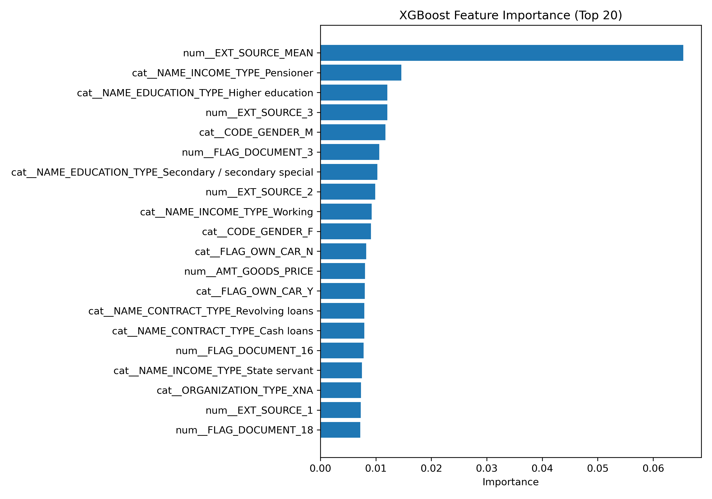
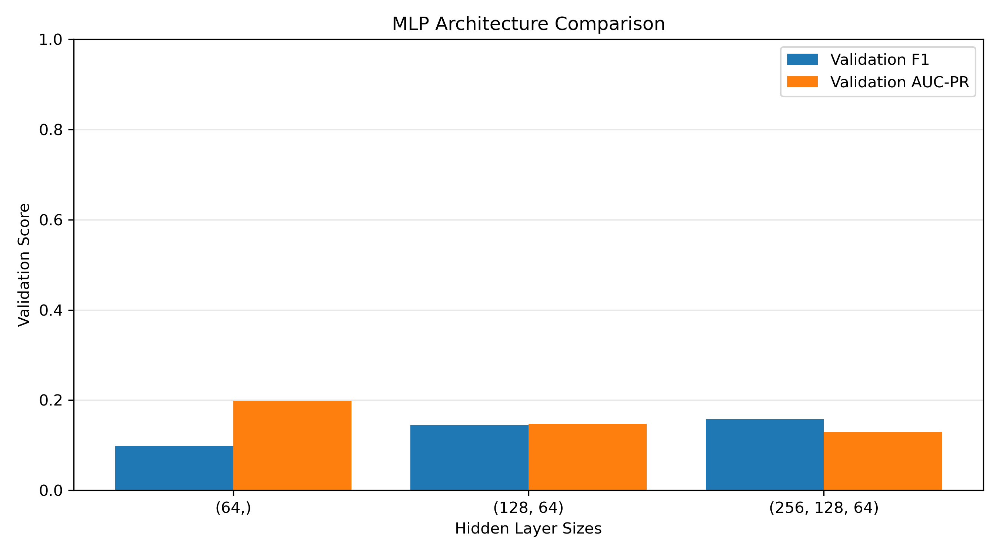
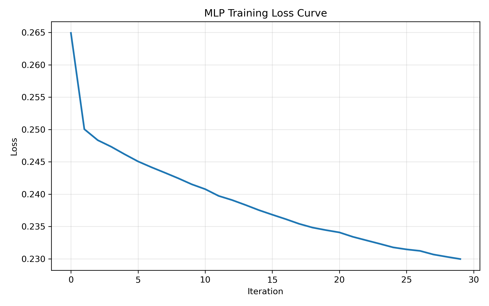
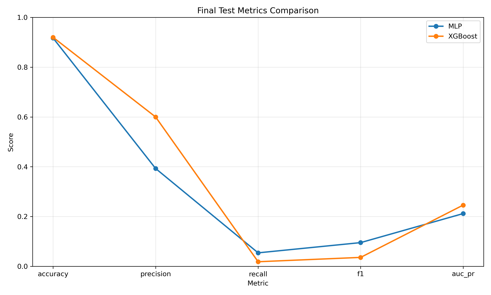

# Home Credit Default Risk Experimental Report

Yitong Bai yb2636 || repo:https://github.com/catRunnerCN/Applied-ML/tree/main/A2

## Introduction

This experiment studies the binary classification task in Kaggle's **Home Credit Default Risk** dataset. The goal is to determine whether a loan applicant is more likely to experience repayment difficulties, where `TARGET=1` indicates higher risk and `TARGET=0` indicates lower risk. The experiment uses only the main table `application_train.csv` without merging other tables, so that the focus can remain on comparing the two models, **XGBoost** and **MLPClassifier**. The original data contains **307,511** samples and **122** columns. After removing the ID column and adding a small amount of feature engineering, the final dataset uses **124** features, including **108** numerical features and **16** categorical features. Since default samples account for only **8.07%** while non-default samples account for **91.93%**, the data is clearly imbalanced. Therefore, this experiment treats **AUC-PR** as the most important metric, while also reporting Precision, Recall, F1, and Accuracy.

## Methods

The data was split using stratified sampling into **Train/Validation/Test = 70%/15%/15%**, corresponding to **215,257 / 46,127 / 46,127** samples. The validation set was used for hyperparameter tuning, and the test set was used only once at the end. All missing-value imputation, standardization, and encoding operations were performed only on the training set and then applied to the validation and test sets, which prevents data leakage. During preprocessing, `SK_ID_CURR` was removed, and the abnormal value `DAYS_EMPLOYED=365243` (appearing **55,374** times) was treated as a missing value. Features with many missing values, such as `COMMONAREA_*`, `NONLIVINGAPARTMENTS_*`, `FLOORSMIN_*`, and `YEARS_BUILD_*`, were still retained. Feature engineering added only four relatively easy-to-understand variables: `CREDIT_INCOME_RATIO`, `ANNUITY_INCOME_RATIO`, `INCOME_PER_FAMILY_MEMBER`, and `EXT_SOURCE_MEAN`. XGBoost uses median imputation for numerical features, mode imputation for categorical features, and one-hot encoding, without standardization; MLP, in addition to these steps, standardizes numerical features and converts the input into dense format.

## Results

### XGBoost

The baseline setting for XGBoost was `n_estimators=1000`, `learning_rate=0.05`, `max_depth=5`, `subsample=0.8`, and `colsample_bytree=0.8`. On the validation set, the results were **Accuracy 0.9195, Precision 0.5476, Recall 0.0185, F1 0.0358, and AUC-PR 0.2465**. This indicates that the model is relatively conservative overall: it is not very likely to classify a sample as positive, but once it does, the prediction is often more reliable. The logloss curve also shows that the training process was relatively stable, although the improvement became very limited in the later stage and slight overfitting appeared.

| Learning Rate | Validation F1 | Validation AUC-PR | Boosting Rounds |
|---|---:|---:|---:|
| 0.01 | 0.0263 | 0.2469 | 1000 |
| 0.10 | 0.0429 | 0.2467 | 193 |
| 0.30 | 0.0395 | 0.2414 | 36 |

If AUC-PR is taken as the main criterion, the result of `0.01` is slightly better. After further comparing tree depth and sampling rate, it can be seen that deeper trees perform better, while an intermediate `subsample` value is usually more stable than `1.0`.

| max_depth | subsample | F1 | AUC-PR |
|---:|---:|---:|---:|
| 3 | 0.6 | 0.0138 | 0.2413 |
| 3 | 0.8 | 0.0123 | 0.2399 |
| 3 | 1.0 | 0.0096 | 0.2383 |
| 5 | 0.6 | 0.0305 | 0.2472 |
| 5 | 0.8 | 0.0263 | 0.2469 |
| 5 | 1.0 | 0.0211 | 0.2457 |
| 7 | 0.6 | 0.0359 | 0.2493 |
| 7 | 0.8 | 0.0339 | 0.2494 |
| 7 | 1.0 | 0.0304 | 0.2486 |

| reg_alpha | reg_lambda | Validation F1 | Validation AUC-PR |
|---:|---:|---:|---:|
| 0.0 | 1.0 | 0.0339 | 0.2494 |
| 0.0 | 5.0 | 0.0334 | 0.2489 |
| 0.0 | 10.0 | 0.0339 | 0.2488 |
| 0.1 | 1.0 | 0.0349 | 0.2490 |
| 0.1 | 5.0 | 0.0344 | 0.2494 |
| 0.1 | 10.0 | 0.0329 | 0.2485 |
| 1.0 | 1.0 | 0.0334 | 0.2493 |
| 1.0 | 5.0 | 0.0334 | 0.2491 |
| 1.0 | 10.0 | 0.0319 | 0.2482 |

The final configuration adopted was `learning_rate=0.01, max_depth=7, subsample=0.8, reg_alpha=0.1, reg_lambda=5.0`. On the validation set, this configuration achieved **Accuracy 0.9198, Precision 0.6055, Recall 0.0177, F1 0.0344, and AUC-PR 0.2494**. From feature importance, `EXT_SOURCE_MEAN` was the most critical feature, followed by `EXT_SOURCE_3`, `EXT_SOURCE_2`, `EXT_SOURCE_1`, `NAME_INCOME_TYPE_Pensioner`, `NAME_EDUCATION_TYPE_Higher education`, `CODE_GENDER_M`, `FLAG_DOCUMENT_3`, and `AMT_GOODS_PRICE`.

### MLP

The baseline setting for MLP was `hidden_layer_sizes=(128,64)`, `activation=relu`, `learning_rate_init=0.001`, and `max_iter=50`. On the validation set, the results were **Accuracy 0.8955, Precision 0.2132, Recall 0.1093, F1 0.1445, and AUC-PR 0.1466**. Compared with XGBoost, MLP is more likely to classify samples as positive, so Recall is higher, but at the same time it produces more false positives, and therefore both Precision and AUC-PR are lower.

| Hidden Layers | Validation F1 | Validation AUC-PR | Train Time (s) |
|---|---:|---:|---:|
| `(64,)` | 0.0977 | 0.1984 | 29.77 |
| `(128, 64)` | 0.1445 | 0.1466 | 54.59 |
| `(256, 128, 64)` | 0.1577 | 0.1294 | 99.31 |

Although deeper networks increased F1, AUC-PR decreased instead, so if AUC-PR is treated as the main metric, `(64,)` is more suitable. In the activation function comparison, `relu` achieved **F1=0.0977, AUC-PR=0.1984**, while `tanh` achieved **F1=0.0992, AUC-PR=0.1887**, so `relu` was kept in the end. The results for learning rate and training epochs are shown below.

| Learning Rate | Validation F1 | Validation AUC-PR | n_iter |
|---:|---:|---:|---:|
| 0.001 | 0.0977 | 0.1984 | 50 |
| 0.01 | 0.0872 | 0.1836 | 50 |
| 0.1 | 0.0005 | 0.1899 | 14 |

| max_iter | Validation F1 | Validation AUC-PR | Train Time (s) |
|---:|---:|---:|---:|
| 30 | 0.0956 | 0.2035 | 20.60 |
| 50 | 0.0977 | 0.1984 | 35.62 |
| 80 | 0.1028 | 0.1849 | 56.36 |

The final configuration adopted was `hidden_layer_sizes=(64,), activation=relu, learning_rate_init=0.001, max_iter=30`. On the validation set, this configuration achieved **Accuracy 0.9164, Precision 0.3764, Recall 0.0548, F1 0.0956, and AUC-PR 0.2035**. The loss curve shows that the training loss continued to decrease, but the validation AUC-PR did not continue to improve, which means that training longer does not necessarily lead to better test performance.

## GBDT vs MLP Comparison

The final test set results are as follows:

| Model | Accuracy | Precision | Recall | F1 | AUC-PR |
|---|---:|---:|---:|---:|---:|
| XGBoost | 0.9198 | 0.6000 | 0.0185 | 0.0359 | 0.2460 |
| MLP | 0.9169 | 0.3930 | 0.0542 | 0.0953 | 0.2119 |

| Model | Best Config | Final Train Time (s) |
|---|---|---:|
| XGBoost | `lr=0.01, depth=7, subsample=0.8, reg_alpha=0.1, reg_lambda=5.0` | 22.35 |
| MLP | `(64,), relu, lr=0.001, max_iter=30` | 25.92 |

From the final results, XGBoost performs better in **AUC-PR 0.2460**, **Precision 0.6000**, and Accuracy, which indicates that it is better at ranking truly high-risk customers near the top and is also more suitable for producing relatively reliable positive predictions under the default threshold. The advantage of MLP lies in **Recall 0.0542** and **F1 0.0953**, which means it can identify more default samples, but at the same time it also brings more false positives. For this kind of task with highly imbalanced positive and negative samples, AUC-PR is more important than Accuracy alone. Therefore, XGBoost is more suitable as the main model, while MLP is more suitable as a comparison model.

## Discussion

Overall, the results are consistent with common experience in tabular-data modeling: GBDT is usually more suitable for this kind of structured data that simultaneously contains numerical features, categorical features, and missing values. The very low Recall of XGBoost mainly reflects that the default classification threshold is relatively conservative, rather than that the model cannot rank samples well. If threshold tuning is further applied, Recall and F1 still have room for improvement. The MLP results show that although deeper networks and longer training time can sometimes improve F1 under a fixed threshold, the overall ranking ability does not improve accordingly and may even decline. The fact that `EXT_SOURCE_MEAN` ranks first also shows that simple but business-meaningful feature engineering is still very valuable. This experiment also has several limitations. For example, it used only the main table and did not fuse information from multiple tables, did not perform threshold tuning, and did not use class weighting or resampling methods. In addition, the MLP used the sklearn version, so the model flexibility is relatively limited. From the perspective of bias and variance, XGBoost achieved a more balanced result under the setting of this experiment.

## AI Tool Disclosure

ChatGPT was used in the writing and organization stage of this report, mainly to compress the original long report, adjust the structure, and polish the language. For experiment design, data cleaning, feature engineering, and the training and tuning of XGBoost and MLP, AI first provided instruction and a code framework, and I then implemented the framework and debugged it together with AI. The result analysis and final conclusions were completed by me. The AI tool participated only in teaching, expression, and organization, and did not replace the experiment itself or the code.
