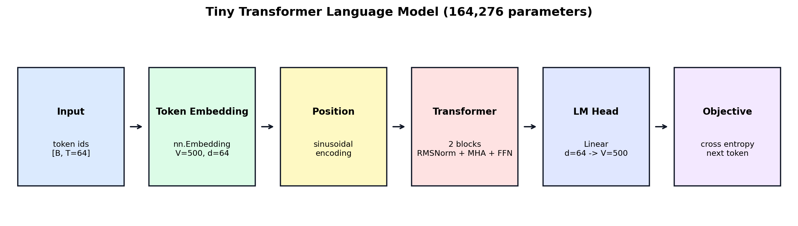
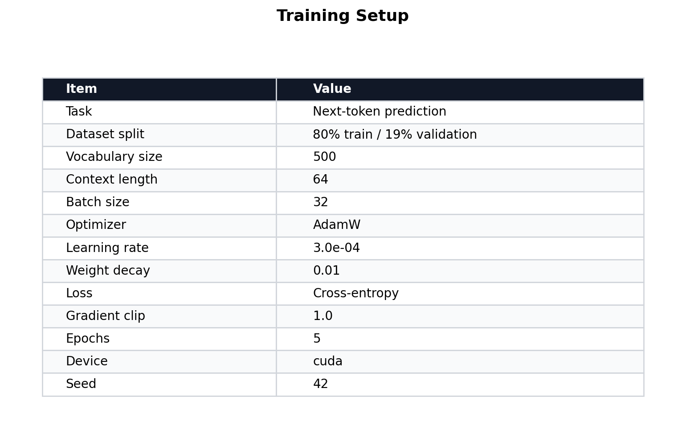
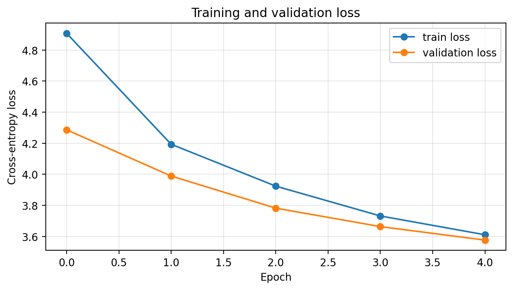
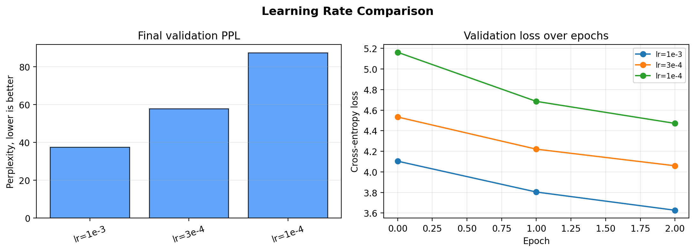
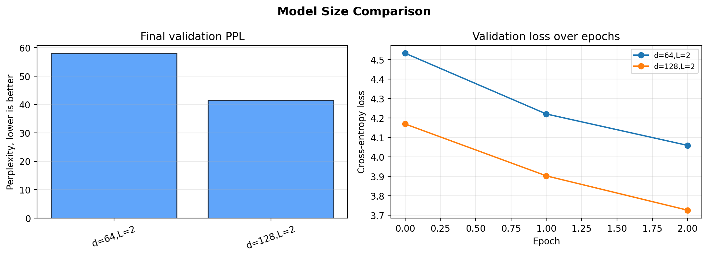
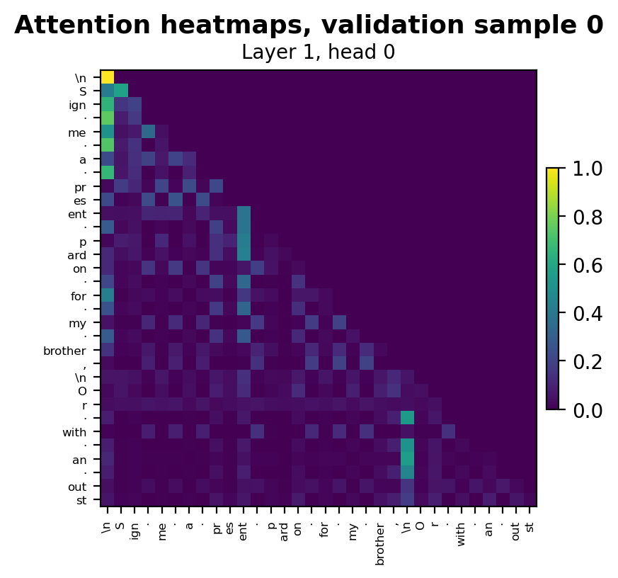
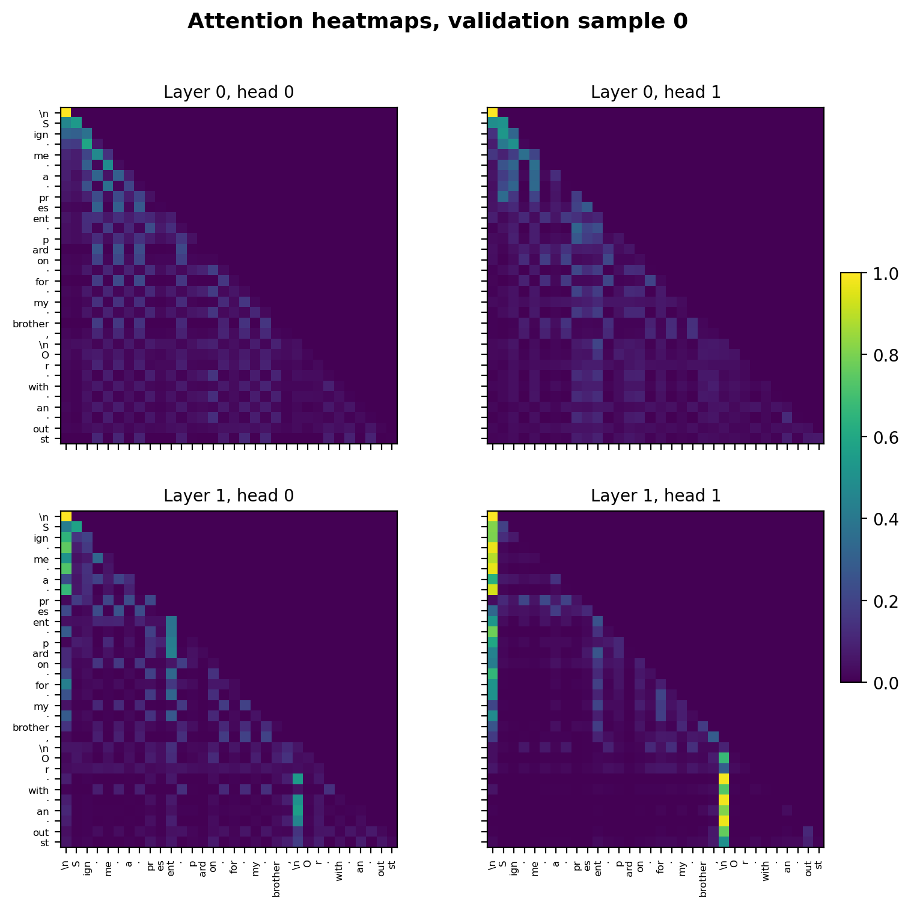
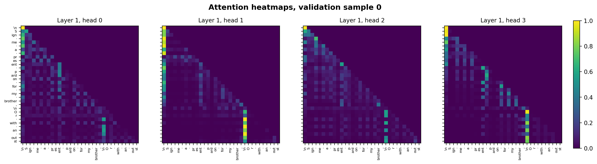

# A3 Report: Tiny Transformer for Shakespeare Next-Token Prediction

## 1. Objective

The goal of this assignment was to build intuition for the Transformer architecture by implementing a small causal language model and applying it to a next-token prediction task. Instead of using a prebuilt Transformer module as the main model, the core components were implemented directly: positional encoding, self-attention, causal masking, residual connections, RMSNorm, and the feed-forward network. The model was intentionally kept small so that the full training and visualization pipeline could run quickly while still exposing the main mechanisms used in modern autoregressive language models.

The assignment emphasized not only model implementation, but also interpretation. For that reason, this report focuses on three questions: whether the model learns to reduce validation loss, how hyperparameters such as learning rate and model size affect stability and perplexity, and what patterns appear in the learned attention maps.

## 2. Dataset and Tokenization

The dataset is the Tiny Shakespeare corpus, which contains 1,115,394 characters of play-style dialogue. The text includes speaker names, colons, punctuation, line breaks, and repeated dramatic structure. These formatting patterns are useful for attention analysis because line breaks and speaker markers can become meaningful context cues.

A custom subword-level BPE tokenizer was trained with a maximum vocabulary size of 500, satisfying the assignment requirement that the vocabulary remain small for lightweight experiments. The tokenizer began with individual character symbols and repeatedly merged frequent adjacent symbol pairs. The final tokenizer had exactly 500 tokens. The full corpus was encoded into 641,904 subword tokens, corresponding to an average compression ratio of 1.74 characters per token.

The encoded token stream was split into fixed-length overlapping sequences with a context length of 64. For every sequence, the input was the first 64 tokens and the target was the same sequence shifted one position to the left. This makes every position a next-token prediction problem. The split followed the assignment specification: 80% of the token stream was used for training and 20% for validation. This produced 513,523 training tokens and 128,381 validation tokens. No test set was used.

| Quantity | Value |
|---|---:|
| Corpus size | 1,115,394 characters |
| Vocabulary size | 500 |
| Encoded corpus length | 641,904 tokens |
| Context length | 64 tokens |
| Training tokens | 513,523 |
| Validation tokens | 128,381 |

## 3. Model Architecture

The model is a small causal Transformer language model. It first maps input token IDs into dense vectors using `nn.Embedding`, then adds sinusoidal positional encodings so that the model can distinguish token order. The sequence is passed through two Transformer blocks. Each block uses pre-normalization with RMSNorm, causal multi-head self-attention, residual connections, and a feed-forward network. The final normalized hidden states are projected back to the vocabulary size to produce next-token logits.

The model configuration is summarized below.

| Component | Setting |
|---|---:|
| Number of Transformer blocks | 2 |
| Hidden size | 64 |
| Attention heads | 4 |
| Feed-forward expansion | 4x |
| Dropout | 0.10 |
| Positional encoding | Sinusoidal |
| Normalization | RMSNorm |
| Parameters | 164,276 |

*Figure 1. Visual summary of the Tiny Transformer language model.*

The causal mask is an essential part of the implementation. During self-attention, each token is allowed to attend only to itself and earlier tokens. This prevents information leakage from future positions and makes the training objective a valid autoregressive next-token prediction problem.

## 4. Training Setup

The model was trained with cross-entropy loss over all positions in each sequence. Validation perplexity was computed from the validation cross-entropy loss using PPL = exp(validation loss). The optimizer was AdamW with weight decay. To make the experiment lightweight, each epoch used a limited number of training batches rather than sweeping through every overlapping sequence in the corpus. This kept the runtime short while still showing clear learning behavior.

*Figure 2. Training configuration used for the main experiment.*

The main training run used a learning rate of 3e-4, batch size 32, context length 64, and five epochs. The run used CUDA and completed in 5.8 seconds. Random seeds were set for reproducibility.

## 5. Main Training Results

The model learned steadily over the five training epochs. Training loss decreased from 4.9081 to 3.6103, while validation loss decreased from 4.2864 to 3.5760. The final validation perplexity was 35.73.

| Epoch | Train Loss | Validation Loss | Validation PPL |
|---:|---:|---:|---:|
| 1 | 4.9081 | 4.2864 | 72.70 |
| 2 | 4.1931 | 3.9886 | 53.98 |
| 3 | 3.9235 | 3.7818 | 43.90 |
| 4 | 3.7314 | 3.6629 | 38.97 |
| 5 | 3.6103 | 3.5760 | 35.73 |

*Figure 3. Training and validation cross-entropy loss over five epochs.*

The validation curve followed the same downward trend as the training curve, which suggests that the model was learning reusable structure rather than only memorizing the sampled training batches. The validation loss was slightly lower than the training loss throughout the run. This is plausible because dropout is active during training but disabled during validation, and because each epoch used a sampled subset of training batches rather than a full deterministic pass through the entire training set.

## 6. Hyperparameter Experiments

Two short controlled experiments were run to support the discussion section: a learning rate comparison and a model size comparison. Each comparison used the same experiment budget of three epochs and 80 training batches per epoch. These experiments should be interpreted as relative comparisons under a fixed lightweight budget, not as fully optimized training runs.

### 6.1 Learning Rate

The learning rate comparison tested 1e-3, 3e-4, and 1e-4 using the same model size. Under this short budget, 1e-3 performed best, reaching a validation loss of 3.6271 and a perplexity of 37.60. The smaller learning rates learned more slowly: 3e-4 reached PPL 57.94, while 1e-4 reached PPL 87.47.

*Figure 4. Learning rate comparison under a fixed short training budget.*

This result suggests that the model was undertrained at lower learning rates during the short experiment. The 1e-3 setting reduced validation loss faster without showing obvious instability over three epochs. However, this does not prove that 1e-3 would always be best for a longer run. A larger learning rate can become unstable when training is extended, so the main run used the more conservative 3e-4 setting.

### 6.2 Model Size

The model size comparison tested hidden sizes 64 and 128 while keeping two Transformer blocks. Increasing the hidden size raised the parameter count from 164,276 to 524,660. Under the same short training budget, the larger model improved validation loss from 4.0594 to 3.7261 and reduced perplexity from 57.94 to 41.52.

*Figure 5. Model size comparison under a fixed short training budget.*

This result indicates that model capacity mattered for this task. The larger model could represent the Shakespeare token patterns more effectively, even though the experiment was still computationally small. The tradeoff is memory and compute: attention cost grows with sequence length, and parameter count grows quickly as hidden size increases. For this assignment, the 64-dimensional model is sufficient for demonstrating the Transformer pipeline, while the 128-dimensional model gives better predictive performance.

## 7. Attention Visualization and Interpretation

The attention visualizations were computed using `torch.no_grad()` during evaluation. Each heatmap shows query tokens on the vertical axis and key tokens on the horizontal axis. The upper-right region is dark because the causal mask prevents every token from attending to future positions.

The decoded validation sequence used for the attention visualizations was:

> “Sign me a present pardon for my brother, / Or with an outst...”

*Figure 6. Close-up of the final layer, head 0 attention pattern.*

The close-up heatmap confirms that the model respects causal attention. Most visible attention mass lies in the lower triangular region. A local diagonal pattern is also visible, meaning many tokens attend strongly to recent context. This is expected in language modeling because nearby tokens often provide the most direct syntactic and lexical information.

*Figure 7. Comparison across layers and attention heads for the same validation sequence.*

The layer/head comparison shows that the attention heads are not identical. Some heads emphasize local context near the diagonal, while others form stronger vertical bands at particular earlier tokens. These vertical bands indicate tokens that many later positions attend to. In this sample, line breaks, punctuation, and subword pieces near clause boundaries receive relatively concentrated attention. This is meaningful for Shakespeare-style text, where formatting and punctuation often mark speaker rhythm, sentence boundaries, and dramatic line structure.

*Figure 8. Final-layer attention heads on a structured validation sequence.*

The final-layer heads show different degrees of specialization. Head 0 remains relatively distributed with local attention and a few salient columns. Other heads show sharper vertical patterns, especially around the newline and the beginning of the next phrase. This suggests that even a small Transformer can allocate attention heads to different contextual roles: some heads track nearby token continuity, while others focus on structural markers.

## 8. Qualitative Generation

A short text generation sample was also produced from the prompt “First Citizen:”. The generated text had some local word-like fragments and occasional Shakespeare-like formatting, but it was not fluent. For example, it produced fragments such as “Be and the he your...” and later generated a speaker-like uppercase sequence. This behavior is consistent with the small scale of the model and the short training budget. The model learned some surface-level token statistics, punctuation patterns, and line breaks, but not enough long-range structure to produce coherent dialogue.

This result is useful qualitatively. It shows that the model did learn more than random token emission, but the final validation perplexity and generation quality both indicate that it remains a toy language model rather than a strong text generator.

## 9. Discussion and Reflection

The most important implementation detail was the causal mask. Without it, the model could attend to future tokens and the next-token prediction task would become invalid. The attention heatmaps provide a useful sanity check: the dark upper-right triangle confirms that future positions are masked.

Positional encoding was also necessary. Self-attention alone is permutation-insensitive: without position information, the model would know which tokens appear in a context window but not where they occur. The sinusoidal positional encoding gives each time step a distinct signal, allowing the model to distinguish recent context from older context. The diagonal attention patterns observed in the heatmaps depend on this ordering information.

The hyperparameter experiments showed that learning rate and model capacity both had clear effects. Under the short experiment budget, 1e-3 learned fastest among the tested learning rates. The 1e-4 run improved too slowly, giving the worst perplexity. The larger hidden size of 128 substantially improved validation perplexity compared with the 64-dimensional model, suggesting that the task benefited from additional capacity.

The main runtime bottleneck in a Transformer is self-attention, whose memory and compute scale quadratically with context length. This assignment used a context length of 64, so attention was inexpensive. If the context length were increased substantially, attention matrices would become the main memory cost. In this implementation, BPE tokenization and repeated experiments also contribute to runtime, but the actual training remained fast because the model and batch budget were small.

The final model achieved a validation perplexity of 35.73. This is reasonable for a small Transformer trained briefly on a limited corpus with a small vocabulary. The model learned local language patterns and some text structure, but the generated sample shows that stronger coherence would require more training, more capacity, better sampling, or a larger dataset.

## 10. Conclusion

This assignment demonstrated the full pipeline of a causal Transformer language model: subword tokenization, shifted next-token targets, embedding and positional encoding, causal self-attention, Transformer blocks, cross-entropy training, perplexity evaluation, and attention visualization. The model trained successfully, with validation loss decreasing from 4.2864 to 3.5760 and validation perplexity reaching 35.73. The attention visualizations showed causal masking, local attention, and head-specific focus on structural tokens. The experiments further showed that learning rate and hidden size materially affected performance. Overall, the results support the main lesson of the assignment: even a small Transformer contains the essential mechanisms that make modern autoregressive language models work.

## AI Tool Usage Disclosure

I used AI assistance to help organize the notebook workflow, refine the report structure, summarize experimental results, and improve the clarity of the writing. The model implementation, experiments, figures, and final interpretation were reviewed and assembled in the context of this assignment.